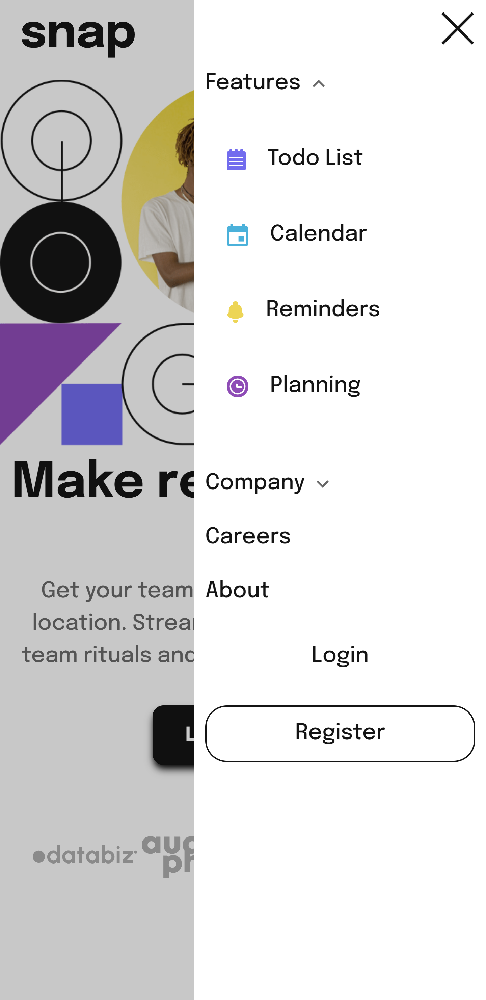

# Frontend Mentor - Intro section with dropdown navigation

## Table of contents

- [Overview](#overview)
  - [The challenge](#the-challenge)
  - [Screenshots](#screenshots)
  - [Links](#links)
- [My process](#my-process)
  - [What I learned](#what-i-learned)
  - [Possible upgrades](#possible-upgrades)

## Overview

### The challenge

The challenge concerned building out this intro section with dropdown navigation and getting it looking as close to the design as possible.

### Screenshots

### Links

Solution URL: https://rafalbodanka.github.io/intro-section-with-dropdown-nav/

## My process

### What I learned

During the challenge, I exercised responsiveness, css flex and grid display. I learned how to make simple dropdown lists.
Additionally, I have preloaded images from dropdown list to avoid laggy image render.

### Possible upgrades

 - Features and company views.
 - Learn more content onclick dropdown.
